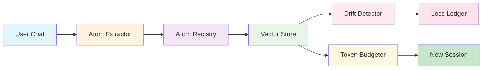
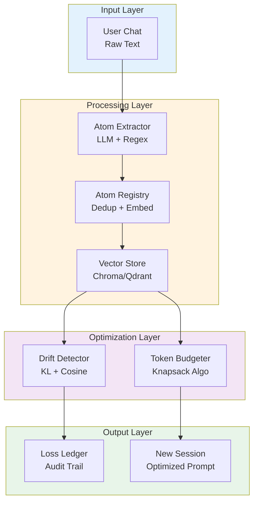
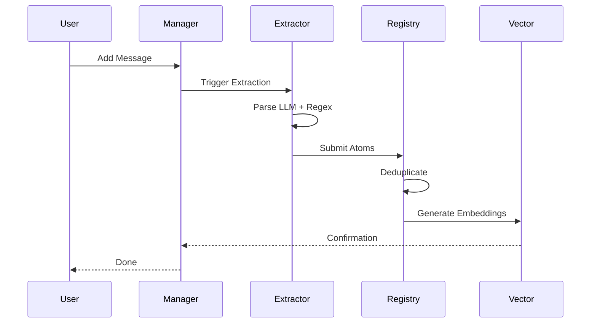
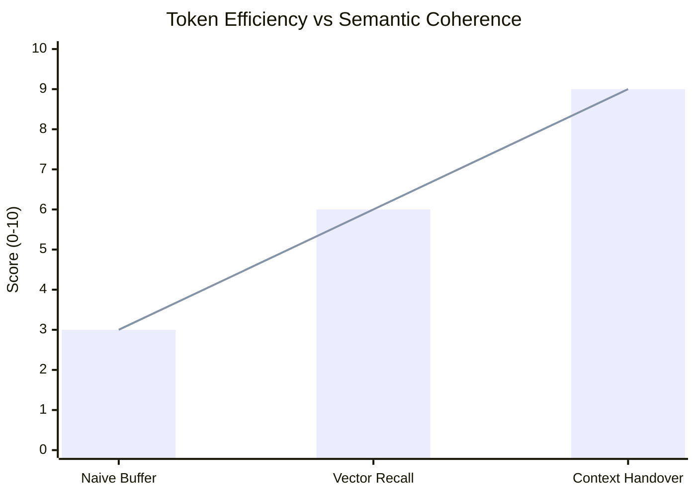
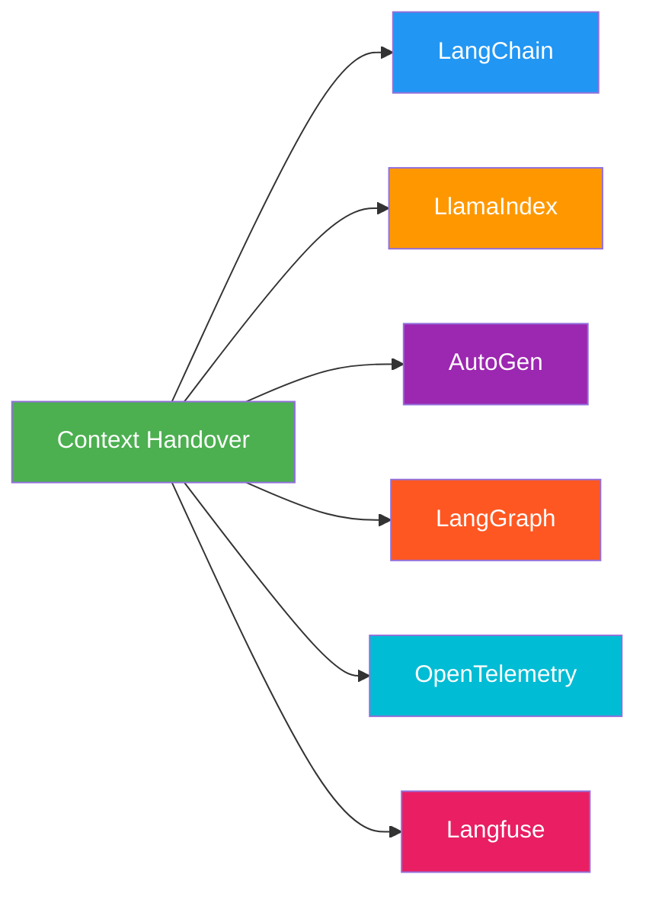
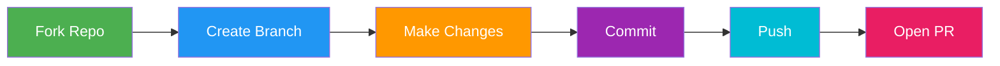

%20(1).png)

<div align="center">


**Preserve Semantic Continuity Across LLM Session Boundaries.** 🐱

[](https://www.python.org/downloads/)
[](LICENSE)
[]()
[]()


</div>

---

> **💡 The Problem:** LLMs forget everything when a session ends. Standard memory is either too dumb (linear history) or too expensive (full vector re-indexing).
>
> **✅ The Solution:** `context_handover` extracts **Semantic Atoms**, measures **Context Drift**, and optimally packs context into new sessions using a **Bounded Knapsack Algorithm**.

---

<div align="center">

### Core Capabilities

| 🔍 **Semantic Extraction** | 📊 **Drift Detection** | 🎯 **Smart Packing** |
|:---:|:---:|:---:|
| Extract meaningful context units | Measure topic shifts in real-time | Optimize token usage mathematically |
| **🔗 DAG Tracking** | **🛡️ Enterprise Ready** | **📈 Visual Analytics** |
| Track dependencies across sessions | Circuit breakers, retries, DLQ | Interactive observability dashboard |

</div>

---

## Visual Overview

### How Context Handover Works



### Token Optimization Comparison

<div align="center">

| Approach | Token Efficiency | Semantic Coherence | Latency |
|:--------:|:----------------:|:------------------:|:-------:|
| ❌ **Naive Buffer** | Low ⚠️ | Low ⚠️ | Fast ✅ |
| ⚡ **Vector Recall** | Medium | Medium | Slow ⚠️ |
| ✅ **Context Handover** | **High** 🎯 | **High** 🎯 | **Fast** ⚡ |

</div>

---

## Quick Start

### 1. Installation
```bash
pip install context-handover
# Optional: For visualizations and vector backends
pip install context-handover[viz,vector]
```

### 2. Hello World
```python
from context_handover import SessionManager, SemanticAtom

# Initialize manager
manager = SessionManager(session_id="session_001")

# Add a meaningful interaction
manager.add_message(
    role="user", 
    content="I want to build a rocket engine using methane."
)
manager.add_message(
    role="assistant", 
    content="Understood. Methane (CH4) offers high specific impulse..."
)

# Extract atoms automatically
atoms = manager.extract_atoms() 
print(f"Extracted {len(atoms)} semantic atoms.")

# Handover to a new session (preserving context)
new_session_pkg = manager.build_handover_package()
manager.handover_to_new_session("session_002", new_session_pkg)
```

### 3. Visualize Your Context
See your context flow, drift, and missing gaps in real-time:
```bash
# Launch the interactive dashboard
streamlit run context_observatory.py
```
*(Opens a local web dashboard at http://localhost:8501)*

---

## How It Works

Unlike linear buffers, we treat context as a **Directed Acyclic Graph (DAG)** of semantic units.

### The Architecture Flow



### Key Concepts

<div align="center">

| Concept | Description | Analogy | Visual |
|:---|:---|:---|:---:|
| **Semantic Atom** | Smallest unit of meaningful context | A single Lego brick | 🔷 |
| **Session DAG** | Tracks atom relationships across sessions | Family tree for chat | 🌳 |
| **Drift Metric** | Measures topic change since last handover | Compass checking course | 🧭 |
| **Knapsack Budget** | Selects most valuable atoms for token limit | Packing a suitcase | 🎒 |

</div>

### Semantic Atom Lifecycle



---

## Visualization Dashboard

Don't fly blind. Use our built-in **Context Observatory** to debug and monitor your agent's memory.

### What You Can See

1.  **Session DAG Map**: Interactive graph of atom dependencies.
2.  **Drift Thermometer**: Real-time gauge of semantic shift.
3.  **Token Knapsack**: Visualizes which atoms were kept vs. dropped due to budget.
4.  **Semantic Space**: 2D clustering of your conversation topics.
5.  **Integrity Gaps**: Heatmap showing missing data or broken dependencies.

### Dashboard Preview

```text
+---------------------------------------------------------------+
|  CONTEXT OBSERVATORY  [Session: 8a7f...]           [Refresh]  |
+---------------------------------------------------------------+
|  [DAG MAP]        |  [DRIFT METRICS]      |  [TOKEN BUDGET]   |
|                   |                       |                   |
|    (O) Fact       |   Gauge: 0.23 (OK)    |   Used: 3.2k/4k   |
|     | \           |   Trend: ↗ Rising     |                   |
|    (D) Dec ---->  |   [||||||....]        |   [####][  ][#]   |
|     |   \         |                       |   Kept  Dropped   |
|    (C) Con        |   KL: 0.12            |                   |
|                   |   Jaccard: 0.45       |                   |
+-------------------+-----------------------+-------------------+
|  [SEMANTIC SPACE]                 |  [INTEGRITY GAPS]         |
|                                   |                           |
|      *   *   (Cluster A)          |   Time ▶                  |
|         *                         |   Topic 1 [||||||] OK     |
|   (Cluster B) *   *               |   Topic 2 [||....] GAP!   |
|                                   |   Topic 3 [||||||] OK     |
+-----------------------------------+---------------------------+
```


## Production Features

<div align="center">

| Feature | Description | Status |
|:---|:---|:---:|
| **🔄 Idempotency** | Duplicate events auto-detected & ignored | ✅ Active |
| **🔁 Smart Retries** | Exponential backoff for LLM/Redis failures | ✅ Active |
| **⚡ Circuit Breakers** | Prevents cascading failures | ✅ Active |
| **📦 Dead Letter Queue** | Failed events saved for replay | ✅ Active |
| **🔒 PII Ready** | Redaction & encryption hooks | 🔧 Configurable |

</div>

---

## Performance Benchmarks

### Comparative Analysis



### Detailed Metrics

<div align="center">

| Metric | Naive Buffer | Vector Recall | **Context Handover** |
|:---|:---:|:---:|:---:|
| **Token Efficiency** | Low ⚠️ | Medium | **High** 🎯 |
| **Semantic Coherence** | Low ⚠️ | Medium | **High** 🎯 |
| **Latency Overhead** | None ✅ | High ~200ms ⚠️ | **Low ~40ms** ⚡ |
| **Auditability** | None ❌ | Low ⚠️ | **Full** ✅ |

</div>

---

## Ecosystem Integration

Works seamlessly with your existing stack:

<div align="center">



</div>

### Integration Examples

| Framework | Integration Type | Status |
|:---|:---|:---:|
| **LangChain** | Custom Memory Module | ✅ Ready |
| **LlamaIndex** | Node Parser | ✅ Ready |
| **AutoGen/LangGraph** | State Handover | ✅ Ready |
| **OpenTelemetry** | Native Tracing | ✅ Ready |
| **Langfuse** | Observability | ✅ Ready |

```python
# Example: LangChain Integration
from langchain.memory import ConversationBufferMemory
from context_handover.integrations.langchain import HandoverMemory

memory = HandoverMemory(session_id="langchain_01")
memory.save_context({"input": "Hi"}, {"output": "Hello!"})
```

---

## Configuration

Create a `config.yaml` to tune behavior:

```yaml
pipeline:
  max_tokens: 4096
  drift_threshold: 0.5
  knapsack_strategy: "value_density" # or 'greedy'

storage:
  backend: "chromadb" # or 'qdrant', 'memory'
  path: "./data/atoms"

observability:
  tracing: true
  metrics_export: "otel"
```

### Configuration Options Overview

<div align="center">

| Category | Option | Default | Description |
|:---|:---|:---:|:---|
| **Pipeline** | `max_tokens` | 4096 | Maximum token budget for handover |
| **Pipeline** | `drift_threshold` | 0.5 | Sensitivity for context drift detection |
| **Pipeline** | `knapsack_strategy` | value_density | Optimization strategy |
| **Storage** | `backend` | chromadb | Vector store backend |
| **Storage** | `path` | ./data/atoms | Local storage path |
| **Observability** | `tracing` | true | Enable distributed tracing |
| **Observability** | `metrics_export` | otel | Metrics export format |

</div>

---

## Documentation & Resources

<div align="center">

### 📚 Complete User Guide

The comprehensive guide to understanding and using Context Handover.

**[Read the Full User Guide →](docs/USER_GUIDE.md)** 🐱

</div>

The User Guide includes:
- ✅ 5-minute quick start walkthrough
- ✅ Deep dive into Semantic Atoms lifecycle  
- ✅ Architecture diagrams explained
- ✅ Advanced tuning for Drift & Budgets
- ✅ Visualization dashboard guide with visualizations
- ✅ API reference
- ✅ Troubleshooting and best practices
- ✅ Real-world examples

<div align="center">

### 💻 Code Examples

Ready-to-run code snippets for common use cases.

```bash
# Run the demo
python examples/run_demo.py

# Run benchmark suite
python examples/benchmark.py
```

</div>

---

## Contributing

We welcome contributions! Check out our [Improvement Plan](IMPROVEMENT_PLAN.md) for open tasks.

### How to Contribute



### Development Setup

```bash
# Install dependencies
poetry install

# Install pre-commit hooks
pre-commit install

# Run tests
pytest tests/ -v
```

<div align="center">

| Step | Command | Purpose |
|:---|:---|:---|
| **1** | `poetry install` | Install all dependencies |
| **2** | `pre-commit install` | Set up git hooks |
| **3** | `pytest tests/ -v` | Run test suite |

</div>

---

## License

MIT License - see [LICENSE](LICENSE) for details.

---

<div align="center">

**Built with ❤️ for the future of agentic memory.** 🐱

</div>
